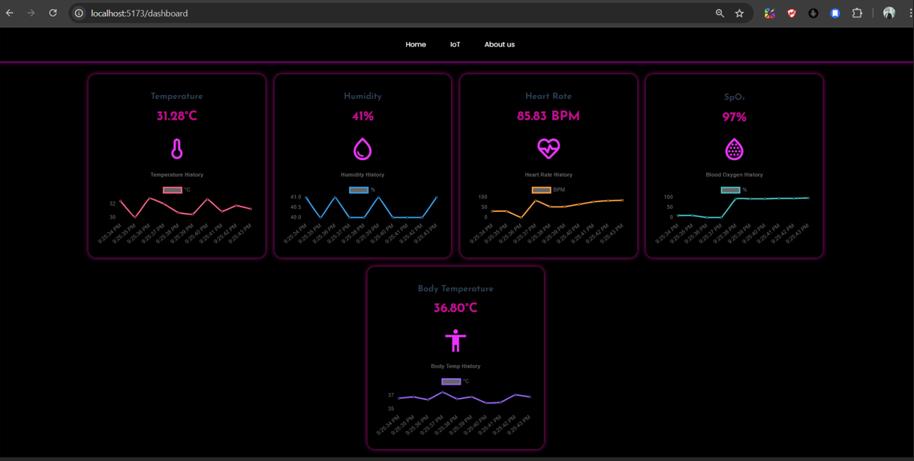

## Healix - IoT Health Dashboard

**Healix - IoT Health Dashboard** is a responsive web interface built to monitor vital health metrics collected from IoT-based sensors in real time. It provides a sleek, modern view of live data such as body temperature, humidity, heart rate, SpO₂ levels, and general ambient temperature. Each parameter includes historical graph data for trend analysis.


IoT Dashboard


## Features

- **Live Sensor Data**: Displays real-time readings for:
  - Ambient Temperature
  - Humidity
  - Heart Rate
  - SpO₂ (Oxygen Saturation)
  - Body Temperature
- **Historical Graphs**: Visualize past readings for each metric to identify trends and anomalies.
- **Dark Mode UI**: Eye-friendly interface with neon-accented visual elements.
- **Responsive Layout**: Optimized for viewing across different screen sizes.

## Technologies Used

- **Frontend**: ReactJs, CSS
- **Backend**: Node.js, ExpressJS
- **Database**: Firebase
- **IoT Protocols**: HTTP, WebSocket

## Installation

### Prerequisites

- Node.js (version)
- npm (version)

## Hardware & Setup

- The **ESP8266** microcontroller is used to collect sensor data and send it to the backend.
- The **Arduino program** must be uploaded to the ESP8266 via the **Arduino IDE**.
- Upon completion of upload, **Arduino IDE must be closed** for server to access serial port.
- The ESP8266 should be **powered through a USB connection** to your PC for data transmission and serial monitoring.

### Steps

1. **Clone the repository**:

   ```bash
   git clone https://github.com/yourusername/your-repo-name.git
   cd iotdashboard
   npm install

   ```

2. **Run**:
   ```bash
   npm run dev
   ```

## Backend Repository

👉 [IoT Dashboard Backend](https://github.com/sp4m-08/iotdash_backend)
