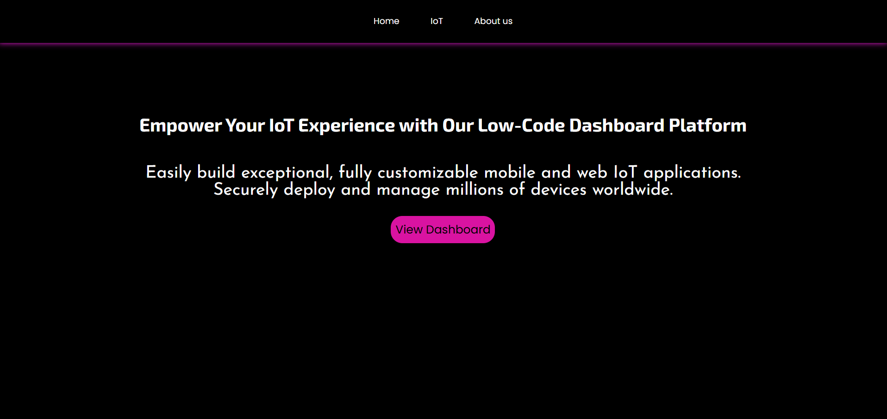
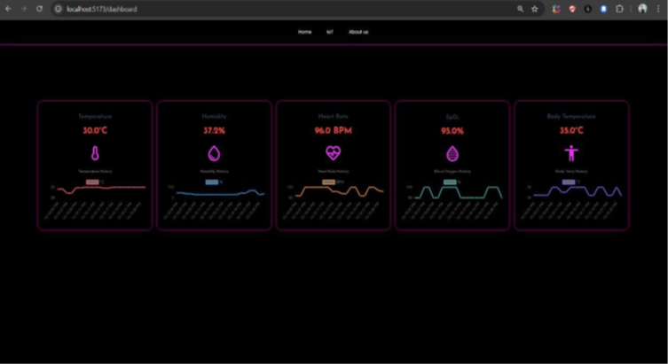

# Custom IoT Dashboard


IoT Dashboard


## Overview

The **Custom IoT Dashboard** is a user-friendly interface designed to monitor and control IoT devices in real-time. This dashboard provides a comprehensive view of device statuses, analytics, and control options, making it easier for users to manage their IoT ecosystem.

## Features

- **Real-time Monitoring**: View the status of all connected IoT devices in real-time.
- **Device Control**: Control devices directly from the dashboard with a simple click.
- **Data Visualization**: Graphical representation of data collected from devices.
- **Alerts and Notifications**: Receive alerts for device malfunctions or important updates.

## Technologies Used

- **Frontend**: ReactJs, CSS
- **Backend**: Node.js, ExpressJS
- **Database**: Firebase
- **IoT Protocols**: HTTP, WebSocket

## Installation

### Prerequisites

- Node.js (version)
- npm (version)

### Steps

1. **Clone the repository**:

   ```bash
   git clone https://github.com/yourusername/your-repo-name.git
   cd iotdashboard
   npm install

   ```

2. **Run**:
   ```bash
   npm run dev
   ```
